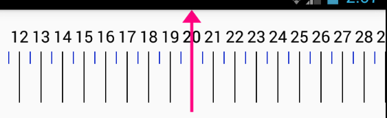
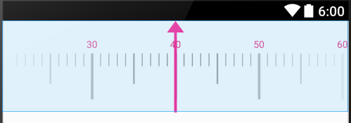

 
# 介绍

这是一个水平的尺子滚轮插件

##上对齐+显示效果

##上对齐+折半显示效果

## 渐显效果

#特性

1. 支持定义字体的大小和颜色和是否显示刻度值
2. 支持定义各个刻度的颜色和大小，目前有大,中,小三者，如图片所示，有最大的是黑色，中等的为绿色，最小的是蓝色。同时刻度间隔和刻度的大小可以调节。
3. 支持自定义中间的指标器。
4. 可以有上和下，两种对齐的方式。
5. 支持指定默认值。
6. 支持设置最大和最小值。
7. 两种刻度格式SCALE和HALF，前者为有10格刻度，后者为只有0.5一格小的刻度。参考图片
8. 刻度尺的渐显效果
9. 支持显示自定义的数据！
10. 刻度值支持渐现的效果
11. 加入代码控制选中数据部分内容。 

# 考虑加入的新特性

  1. 支持修改文字和刻度的间距定制
   

# 使用方法

## XML 默认方式

       <com.xk.sanjay.rulberview.RulerWheel
            android:id="@+id/ruler_view"
            android:layout_width="match_parent"
            android:layout_height="400dp"

            app:MaxBarSize="3dp"
            app:MidBarSize="2dp"
            app:MinBarSize="1dp"
            app:scaleWidth="1dp"
            //不想设置各刻度的大小时，可以用这个设置所有的,不过scaleWidth优先级低于上面的
            
            app:lineColorMax="#797979"
            app:lineColorMid="#797979"
            app:lineColorMin="#797979"
            app:line_divider="10dp"

            app:max_value="100"
            app:min_value="20"
            app:def_value="40"
            
            app:mode="SCALE"
             app:alignMode="UP"

            app:showGradient="true"
            app:showScaleValue="true"
            app:text_Size="30"
            app:text_color="#e21d6f"/>

            
##  Activity

		rulerView = (RulerWheel) findViewById(R.id.ruler_view);
        rulerView.setScrollingListener(new RulerWheel.OnWheelScrollListener() {
            @Override
            public void onChanged(RulerWheel wheel, int oldValue, int newValue) {
                Log.e(TAG, "curValue=" + newValue);
            }

            @Override
            public void onScrollingStarted(RulerWheel wheel) {

            }

            @Override
            public void onScrollingFinished(RulerWheel wheel) {

            }
        });            
            
# 鸣谢
特别感谢[獨行Zz](http://blog.csdn.net/dashu8193058/article/details/45846189)，这个项目是在他基础上改的。

还有需要别的欢迎在这个基础自己定制
